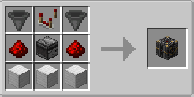

# Апгрейдер предметов

Мод для Minecraft 1.21.1 на NeoForge. Апгрейдер превращает обычные предметы в награды через рискованный бросок с настраиваемым количеством и шансом успеха.

## Установка

Скачайте готовый файл `.jar` из [релиза](https://github.com/Max31267/calgrader/releases) и поместите его в папку `mods` установленного NeoForge 21.1.250 для Minecraft 1.21.1.

## Что есть

- блок «Апгрейдер предметов»;
- объёмная 3D-модель блока с корпусом, панелью и декоративными деталями;
- на наклонной панели есть центральный круг и два боковых слота;
- русский интерфейс в стиле Minecraft;
- до 64 предметов во вкладе;
- выбор награды из обычных предметов Minecraft, доступных в выживании;
- поиск по списку предметов;
- выбор количества награды от 1 до 64;
- ценность предметов и расчёт шанса по соотношению ценностей;
- максимальный шанс успеха — 95%;
- анимация стрелки, звук прокрутки, победы и проигрыша;
- защита от помещения самого апгрейдера в его слот.

## Как играть

Положите в левый слот до стака предметов. Нажмите на правый слот, найдите награду и выберите её количество ползунком. Кнопка «Прокачать» запускает стрелку. Если она остановится в жёлтом секторе, награда выпадет над блоком; иначе вклад пропадёт. Закрытие меню во время прокрутки не отменяет результат.

## Шанс и стоимость

У каждого обычного предмета Minecraft своя ценность. Ценность вклада равна стоимости одного предмета, умноженной на его количество; ценность награды считается так же. Шанс равен отношению этих ценностей, но не выше 95%. Например, стак брёвен ценностью 1 каждое против одного алмаза ценностью 250 даёт шанс 25,6%. Предметы других модов не принимаются как награда и не имеют ценности для вклада.

## Рецепт

## Версии

- Minecraft: 1.21.1
- NeoForge: 21.1.250
- Версия мода: 1.0.4

## Права

Мод распространяется с пометкой **All Rights Reserved**. Файл `TEMPLATE_LICENSE.txt` относится только к исходному шаблону NeoForge, а не даёт разрешения на использование исходников самого мода.
